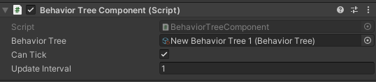

# Behavior Tree Component

The behavior tree component is a [MonoBehavior](https://docs.unity3d.com/ScriptReference/MonoBehaviour.html) is responsible for controlling and executing a behavior tree asset. The only way to execute a behavior tree is to attach this component to a GameObject and assigna behavior tree asset to it.

## Tick

When [CanTick](https://unity-behavior-tree-docs.netlify.app/api/bt.runtime.behaviortreecomponent#BT_Runtime_BehaviorTreeComponent_canTick) is set to false, component will run the behavior tree on each game update; otherwise, if set to false, it will use a user defined interval defined by the [UpdateInterval](https://unity-behavior-tree-docs.netlify.app/api/bt.runtime.behaviortreecomponent#BT_Runtime_BehaviorTreeComponent_updateInterval) property

## Override assigned behavior tree

Currently running behavior tree can be replaced by another tree asset at runtime by using the [BehaviorTreeComponent.RunBehaviorTree()](https://unity-behavior-tree-docs.netlify.app/api/bt.runtime.behaviortreecomponent#BT_Runtime_BehaviorTreeComponent_RunBehaviorTree_BT_Runtime_BehaviorTree_) method.