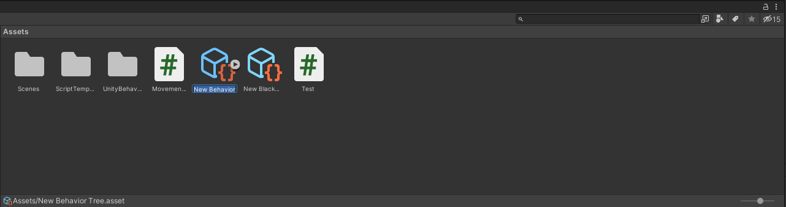
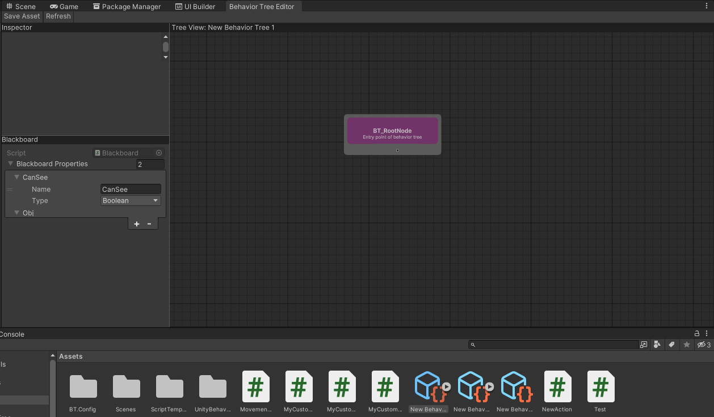
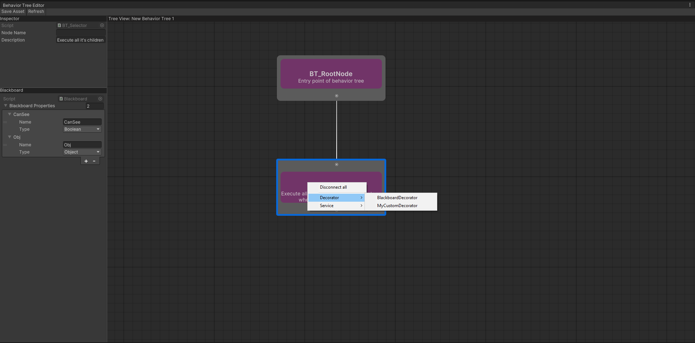
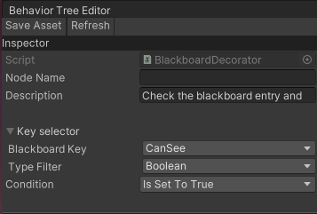

# Behavior Tree Guide

In this article you find a step-by-step guide on how to get started using the Behavior Tree Editor.

## Creating and assigning a Behavior Tree asset

1. To create a new Behavior Tree asset go to <b>Assets->Create->AI->Behavior Tree</b> 
2. Edit the asset name and confirm it's creation, once you've done that double-click on the asset to open the Behavior Tree editor and inspect the selected asset. Behavior Tree assets can be inspected in the editor by double-clicking on them.  You can also open the Behavior Tree Editor window by going to: <b>Window->AI->Behavior Tree Editor</b>; and then double-click on the desired Behavior Tree asset to display it in the graph. 
3. Developers can inspect the asset by selecting it in the content browser. Once in the inspector, they will be able to assign a Blackboard asset to the tree. If you don't know what a Blackboard is, check out the [Blackboard Overview page.](blackboard.md)

## Using the Behavior Tree Editor

1. Select the behavior tree you want to edit. Selected asset will be displayed inside the behavior tree editor.

2. Right-click inside the behavior tree graph to pen the contextual menu; Use it to select the type of node you want to create. In this case we're gonna create a selector node 

3. Click on nodes input/output ports and drag the spawned line to the destination node port. By doing so you're going to create a link between the two nodes.
<video src="../videos/CreateConnectionExample.mp4" controls title="Title" style="margin-top:10px; width:auto,height:auto"></video>

4. You can right click on parent nodes to open the contextual menu and choose which child node to create and attach to it. For more informations on parent and child nodes look at the [Behavior Tree introduction page.](../articles/behavior-tree.md)

5. You can inspect and edit nodes properties by clicking on the nodes and interacting with the editor inspector section.

6. You can copy/paste nodes inside the current or other behavior tree graphs. 
<video src="../videos/CopyPasteExample.mp4" controls title="Title" style="margin-top:10px; width:auto,height:auto"></video>