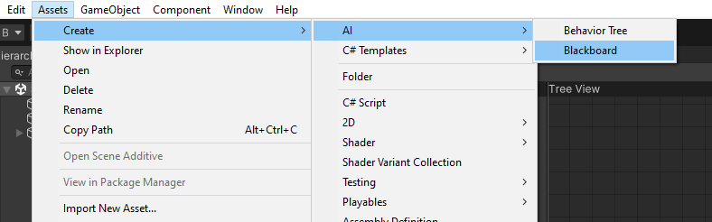
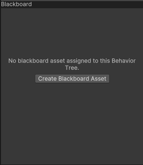
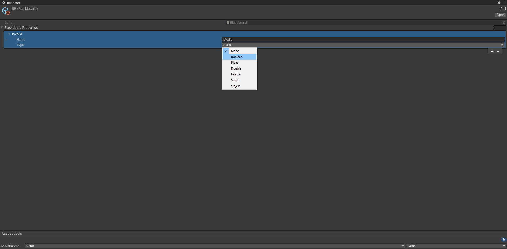
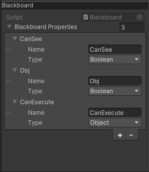

# Blackboard guide

In this article you find a step-by-step guide on how to get started using the Blackboard.

## Creating blackboard

1. Go to the <b>Assets/Create/AI/Blackboard</b> and right click on it, doing this will create a blackboard asset.
   

   You can also create blackboard assets inside the behavior tree editor if you have not assigned any blacboard to the tree asset.  
  
   
2. Inside the blackboard inspector you can add and remove blackboard properties. Blackboard supported types can be found [here](https://unity-behavior-tree-docs.netlify.app/api/BT.Runtime.BlackboardSupportedTypes)

   You can also edit behavior tree asset inside the behavior tree editor.
   > ![NOTE]
   > To inspect a blackboard inside the behavior tree editor, blackboard asset MUST be assigned to the behavior tree asset.

   