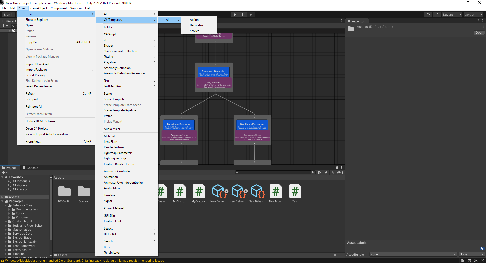

# Custom nodes

When working with the Behavior Tree you can define your own nodes. Understanding how to create custom nodes it's crucial because allows developers to write their own logic in form of behavior tree nodes and then create them inside the editor.
You can create custom nodes by going to <b>Assets/Create/C# Templates/AI/</b>.

> [!CAUTION]
> Do not remove or rename files related to behavior tree nodes(even custom ones), it could lead to data
> corruption, therefore making the behavior tree asset obsolete. BE CAREFUL!