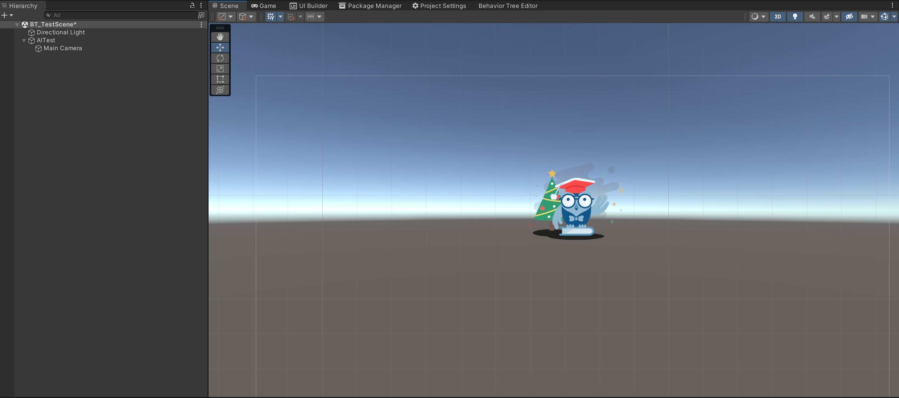
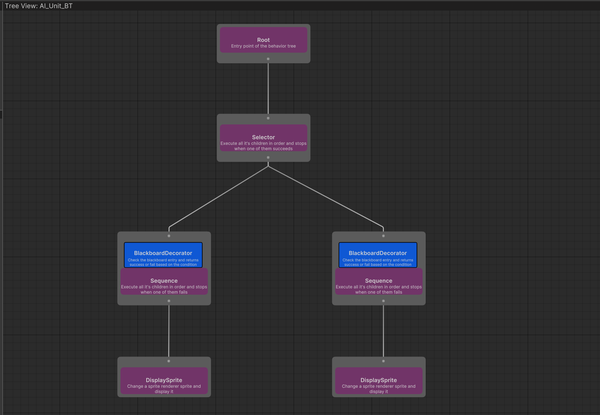
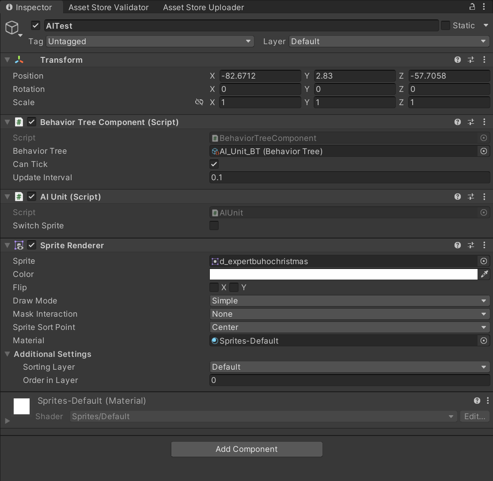

# Behavior Tree quick tutorial

This tutorial will provide a <b> really basic </b> example on how to use the behavior tree.<br>
In this case, we're gonna use the behavior tree to change the sprite of an AI unit placed inside the scene.

## 1. Setup the scene

Setup your current scene with an AIUnit game object and a camera relative to it.



## 2. Create assets

### Create the Behavior Tree Asset

Create the following behavior tree:



Once you've created it, set one decorator to evaluate to true when a given blackboard key is false by changing the
<b>condition</b> from <b>Is Set To True</b> to <b> Is Set To False</b>. In my case i did this to the decorator attached
on the rightist sequence node.

### Create a Blackboard Asset

The next step is to create a blackboard asset to store data for the behavior tree.<br>
Create a blackboard asset with the following properties:


Once created, assign the blackboard asset to the behavior tree.

## 3. Create scripts

### Create AI Controller script

Now we need to create the following AI Controller script:

```csharp
using BT.Runtime;
using UnityEngine;

/// <summary>
/// A small script used just for testing out
/// behavior tree functionalities.
/// </summary>
public class AIUnit : MonoBehaviour
{
    /// <summary>
    /// Depending on if it is true or false, switch the sprite.
    /// </summary>
    public bool switchSprite;
    
    // BT object references
    private BehaviorTreeComponent behaviorTreeComponent;
    private Blackboard blackboard;
    
    private void Awake()
    {
        // Use the behavior tree component to access it's blackboard object reference.
        behaviorTreeComponent = GetComponent<BehaviorTreeComponent>();
        blackboard = behaviorTreeComponent.tree.blackboard;
        
        // Set this component owner(gameObject) as the owner of the
        // behavior tree. N.B. Owner it's just a property of the blackboard.
        blackboard.SetBlackboardValue("Owner", gameObject);
    }
    
    // Update is called once per frame
    void Update()
    {
        // Check on each update if the switchSprite property has changed,
        // and keep updated the associated blackboard property.
        blackboard.SetBlackboardValue("ShowImage", switchSprite);
    }
}
```
All this script does is keeping track of a boolean property which decides what sprite should appear on screen.
For more info look at code comments.

### Create DisplaySprite action

Now we need a custom node which will be responsible for performing our task.
Create a node called DisplaySprite as the following:

```csharp
using BT.Runtime;
using UnityEngine;

public sealed class DisplaySprite : BT_ActionNode
{
    /// <summary>
    /// The sprite to display.
    /// </summary>
    public Sprite sprite;
    
    /// <summary>
    /// The sprite renderer used to render the target sprite.
    /// </summary>
    private SpriteRenderer spriteRenderer;
    
    // Called when the behavior tree wants to execute this action.
    protected override ENodeState Execute()
    {
        if (spriteRenderer != null)
        {
            spriteRenderer.sprite = sprite;
            state = ENodeState.Success;
        }
        else
        {
            state = ENodeState.Failed;
        }
        
        return state;
    }
    
    // Called to initialize this action properties before first update.
    protected override void OnInit()
    {
        GameObject obj = blackboard.GetBlackboardValueByKey<GameObject>("Owner");
        spriteRenderer = obj.GetComponent<SpriteRenderer>();
    }
    
    // Called when the behavior tree starts executing this action
    protected override void OnStart()
    {
    }
    
    // Called when the behavior tree stops executing this action
    protected override void OnStop()
    {
    }
    
// Put here editor only logic
#if UNITY_EDITOR
    
    // for BT nodes the constructor is a editor only method, do not use it at runtime!
    private void OnEnable()
    {
        description = "Change a sprite renderer sprite and display it";
    }

#endif
}
```
all this action does is switching the sprite renderer sprite with the one assigned to this action.
Read code comments for more info.

## 4. Attach MonoBehaviors to game object

Now attach the following components to our game object: <b> SpriteRenderer, BehaviorTreeComponent and AIUnit</b>



Once you've done it, assign our behavior tree asset to the component and you're good to go!à

## 5. Result

The result should be following:

<video src="../videos/Tutorial-SwitchSpriteResult.mp4" controls title="Title"></video>

You can also go inside the behavior tree editor during play mode to check realtime debugging of the tree:

<video src="../videos/Tutorial-SwitchSpriteDebug.mp4" controls title="Title"></video>